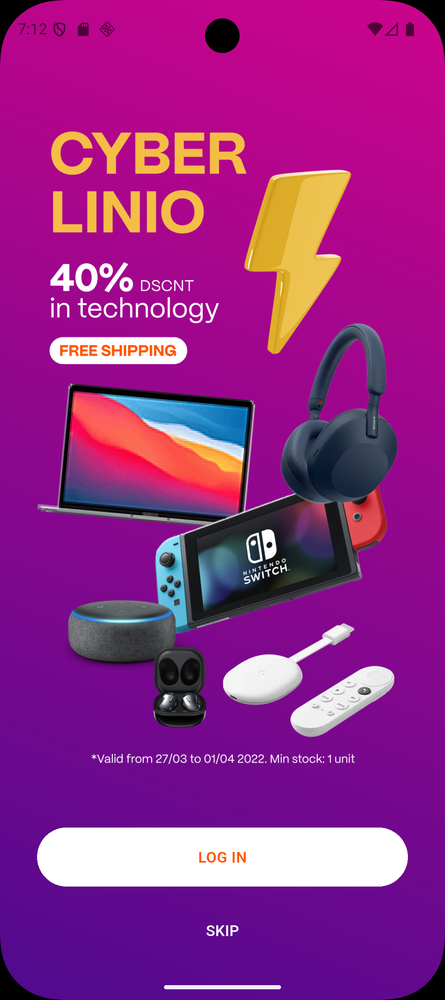
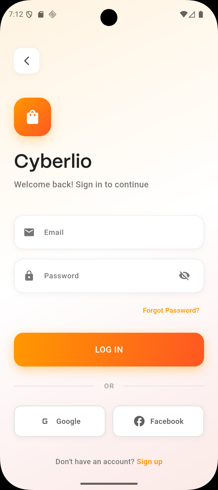
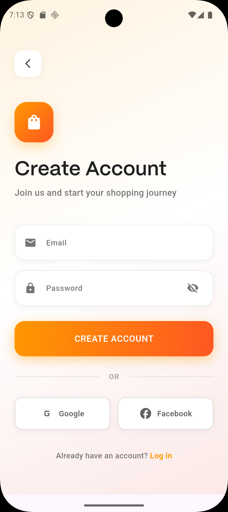
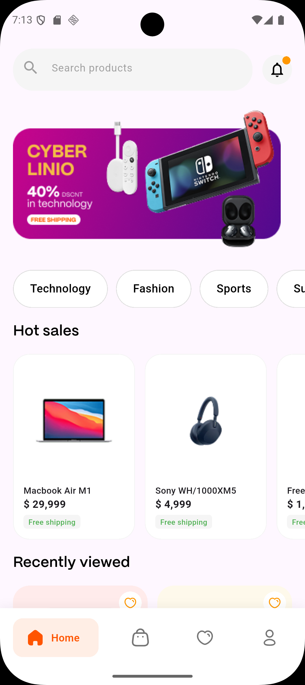
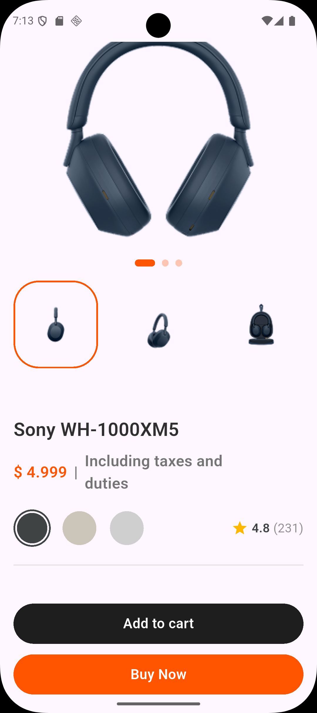
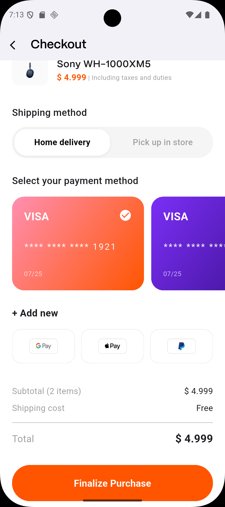
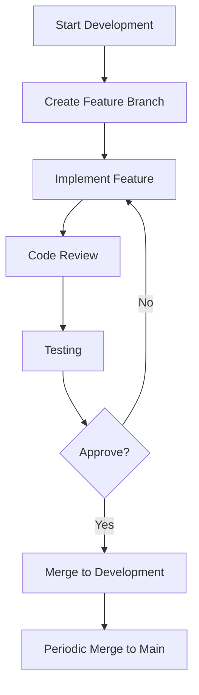

# Cyberlio - E-Commerce App

> A modern, feature-rich e-commerce application built with Flutter

[](https://flutter.dev/) [](https://dart.dev/) [](https://opensource.org/licenses/MIT)

## 🚀 Overview

Cyberlio is a comprehensive e-commerce mobile application designed to provide users with a seamless shopping experience. Built with Flutter, it offers cross-platform compatibility and a native-like experience on both iOS and Android devices.

## ✨ Features

### 🎯 Core Features
- **Onboarding Experience**: Intuitive welcome flow for new users
- **User Authentication**: Secure login and signup functionality
- **Product Discovery**: Browse products by categories and search
- **Product Details**: Detailed product views with images, descriptions, and options
- **Shopping Cart**: Add/remove items and manage your shopping list
- **Favorites/Wishlist**: Save products for later
- **Checkout Process**: Complete purchase flow with shipping and payment options
- **User Profile**: Account management and order history

### 🎨 UI/UX Features
- **Responsive Design**: Adapts to different screen sizes using flutter_screenutil
- **Modern UI**: Clean, intuitive interface with smooth animations
- **Bottom Navigation**: Easy access to main sections (Home, Shop, Favorites, Profile)
- **Promotional Banners**: Featured deals and offers
- **Category Navigation**: Organized product browsing
- **Recently Viewed**: Personalized recommendations

### 🛠️ Technical Features
- **Flutter Framework**: Cross-platform development
- **Responsive Layout**: ScreenUtil for pixel-perfect UI
- **SVG Support**: Vector graphics for crisp icons
- **Modern Navigation**: Route-based navigation system
- **Custom Widgets**: Reusable UI components
- **Theme Management**: Consistent color scheme and typography

## 📱 Screenshots

<div align="center">

### Home Screen
  

### Product View
  

### Shop Categories
  

### Checkout Process
  

### Profile Screen
  

### Onboarding
  

</div>

## 🛠️ Tech Stack

| Technology | Purpose |
|------------|---------|
| [Flutter](https://flutter.dev/) | Cross-platform mobile development |
| [Dart](https://dart.dev/) | Programming language |
| [Flutter ScreenUtil](https://pub.dev/packages/flutter_screenutil) | Responsive UI design |
| [Flutter SVG](https://pub.dev/packages/flutter_svg) | Vector graphics support |
| [Google Nav Bar](https://pub.dev/packages/google_nav_bar) | Bottom navigation |

## 🎨 Design System

### Color Palette
- **Primary Orange**: `#FF5500` - Main brand color
- **Orange Gradient**: `#FF8FB1` to `#FF5500`
- **Purple Gradient**: `#7B2FF7` to `#3B108B`
- **Neutral Colors**: Various shades of grey for text and backgrounds

### Typography
- **Font Family**: PPMori SemiBold
- **Responsive Text**: Adapts to different screen sizes

## 🏗️ Architecture

The app follows a feature-based architecture with the following structure:

```
lib/
├── core/                 # Shared components
│   ├── constants/        # App-wide constants
│   ├── helper/           # Utility functions
│   ├── routing/          # Navigation routes
│   ├── theme/            # Design system
│   └── widgets/          # Reusable UI components
└── features/            # Feature modules
    ├── auth/            # Authentication
    ├── bottom_nav/      # Bottom navigation
    ├── checkout screen/ # Checkout flow
    ├── favorites/       # Wishlist functionality
    ├── home/            # Home screen
    ├── onboarding/      # Onboarding flow
    ├── product/         # Product details
    ├── profile/         # User profile
    └── shop/            # Shop browsing
```

## 📋 Workflow

### Development Workflow
1. **Feature Development**: Create new features in the `development` branch
2. **Code Review**: Submit pull requests for review
3. **Testing**: Ensure all features work as expected
4. **Merge**: Integrate approved changes into `main` branch

### Branch Strategy
- `main`: Production-ready code
- `development`: Active development branch

### Development Process


## 🚀 Getting Started

### Prerequisites
- Flutter SDK (3.10.1 or higher)
- Dart SDK (bundled with Flutter)
- Android Studio / VS Code
- iOS Simulator / Android Emulator (for testing)

### Installation

1. **Clone the repository**
```bash
git clone <repository-url>
cd e_commerce_app
```

2. **Get dependencies**
```bash
flutter pub get
```

3. **Run the application**
```bash
flutter run
```

### Available Commands

```bash
# Run the app
flutter run

# Run tests
flutter test

# Build for Android
flutter build apk

# Build for iOS
flutter build ios

# Analyze code
flutter analyze

# Format code
flutter format .
```

## 🧪 Testing

The app includes widget tests to ensure UI components function correctly:

```bash
flutter test
```

## 🚢 Deployment

### Android
```bash
flutter build apk --release
```

### iOS
```bash
flutter build ios --release
```

## 🤝 Contributing

1. Fork the repository
2. Create a feature branch (`git checkout -b feature/amazing-feature`)
3. Commit changes (`git commit -m 'Add amazing feature'`)
4. Push to the branch (`git push origin feature/amazing-feature`)
5. Open a Pull Request

## 📄 License

This project is licensed under the MIT License - see the [LICENSE](LICENSE) file for details.

## 📞 Support

If you have any questions or feedback, feel free to reach out!

---

<div align="center">

**Cyberlio E-Commerce App** © 2026

</div>
